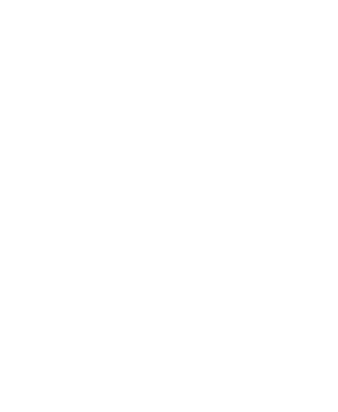

<div align="left">
  
  <h1>pt</h1>
  <p><strong>Utility library with tools for point arithmetic</strong></p>
</div>

[](https://github.com/KGuz/pt/actions/workflows/ci.yml)
[](https://www.repostatus.org/#active)
[](#license)

## About

This Rust library was created to provide easy-to-use utility structures for 2D and 3D points, along with basic arithmetic operations for these structures. The library was designed to simplify geometric computations in Rust programs, by providing a set of simple and robust data structures.

The library is ideal for use in games, simulations, and other applications that require efficient and accurate geometric computations. By providing a set of generic point structures that can be used with both integer and floating-point coordinates, the library offers a flexible and powerful toolset for developers.

Whether you're working on a complex simulation or a simple game, this library can help simplify your code and improve performance, by providing a set of reliable and optimized point structures that are easy to use and integrate into your programs.

## Getting Started

To get started using this library, simply add the following line to your **Cargo.toml** file

```toml
pt = { git = "https://github.com/KGuz/pt.git" }
```

## Examples

Here are some examples of basic arithmetic operations using the pt library

```rust
use {approx::*, pt::*};

let a = pt![1., 1.];
let b = pt![1., 0.];

// Basic arithmetic
let equation = ((1. + b) * 1. - a * a) / 1.;
assert_eq!(equation, pt![1., 0.]);

// Linear algebra
let equation = (a.cross(&b).mag() / a.dot(&b)).atan();
assert_relative_eq!(equation, a.angle(&b));
```

## Contributing

See the [contributing](Contributing.md) guide for detailed instructions on how to get started with this project.

## License

The project is made available under the MIT license. See the [license](License.md) file for more information.
